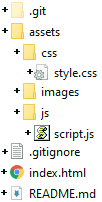

# Local Weather Dashboard - Current and 5-Day Forecast

# Application Scope

# User Story
As A traveler I want to see the weather outlook for multiple cities, so that I can plan a trip accordingly.

# Acceptance Criteria
Given a weather dashboard with form inputs:
> 1. When I search for a city, then I am presented with current and future conditions for that city and that city is added to the search history
> 2. When I view current weather conditions for that city, then I am presented with the city name, the date, an icon representation of weather conditions, the temperature, the humidity, the wind speed, and the UV index
> 3. When I view the UV index, then I am presented with a color that indicates whether the conditions are favorable, moderate, or severe
> 4. When I view future weather conditions for that city, then I am presented with a 5-day forecast that displays the date, an icon representation of weather conditions, the temperature, the wind speed, and the humidity
> 5. When I click on a city in the search history, then I am again presented with current and future conditions for that city

# Repository 
The developer performed the following steps to initiate the project.

1. Logged into developers GitHub portal
2. Created a new repository named "weather" and a readme.md file
3. Enabled the repository’s web page features, which are found under the repository’s settings > pages
4. Opened Git Bash terminal entered the following commands:
>> - cd to desktop/projects
>> - git clone git@github.com:bkelley1/weather.git (clone developer's repository)
>> - cd weather
>> - touch index.html (make index.html)
>> - touch .gitignore (make .gitignore)
>> - mkdir assets (make directory assets)
>> - cd assets (change directory to assets)
>> - mkdir images (make directory images)
>> - mkdir js (make directory js)
>> - cd js (change directory to js)
>> - touch script.js (make script.js)
>> - cd .. (change directory to assects)
>> - mkdir css (make directory css)
>> - cd css (change directory to css)
>> - touch style.css (make style.css)
>> - cd ../../ (change directory to local repository root)
>> - git add - A
>> - git commit -m"initial commit"
>> - git push origin main
>> - git checkout -b develop
These steps completed the creation of the initial project files and directories. The image below illustrates the local repository created.
>> 

# Application & Code Repository
A working version of the application and repository are available at the following locations.
>>> Deployed Application: https://bkfleet1.github.io/weather/
>>> Application Repository: https://github.com/bkfleet1/weather

## Installation Instructions
1. Log into GitHub repository - https://github.com/bkfleet1/weather
>> 

2. Click on CODE button and copy ssh link - git@github.com:bkelley1/weather.git
>> The following image illustrates the process of copying the SSH link.
>> [illustration of how to copy SSH link to clone](./assets/images/clone.gif)

3. Open terminal application (e.g., Git Bash) and enter the following commands:
>> - cd [directory name where you want to store project files] (e.g., cd desktop/projects)
>> - git clone [paste copied link] (clone repository)

# Application Files
The following narrative describes the content and functions of each application file (i.e., index.html, style.css, script.js). 

## HTML Structure - index.html
The application has a single HTML file (i.e., index.html) with the following element structure. Elements with a (*) are dynamically created by functions within the application's javascript file (i.e., script.js).

> - head
> - body
> - div class = container
>> - div class = banner *
>> - div class = row * 
>>> - div class = searchDiv * (contains search form and peristent city names)
>>>> - form class = cityForm * (form for user to enter city name)
>>> - div class = weatherDiv * (contains all weather - current and forecast data)
>>>> - div class = currentWeather * (contains the current weather)
>>>> - div class = forecastBanner * (5-day forecast banner)
>>>> - div class = forecastWrapper * (contains the daily weather forecasts (qty 5))
>>>>> - div class = dailyDiv * (contains the daily weather forecast)
> - script

### Styling Resources Defined
The index.html file has two styling resources defined in the HEAD element.
> 1. Bootstrap 5.1.3 cdn, which is utilized to provide screen responsiveness.
> 2. style.css (i.e., located in ./assets/css/), which provides the visual styling for fonts, blocks, images, and other UI elements.

### Script Resources Defined
The index.html file has two scripting resources defined at the bottom of the BODY element.
> 1. Jquery 3.6.0 cdn, which provides a library of functions used within the script.js file.
> 2. script.js (i.e., located in ./assets/js/), which contains the functions used to create elements within the HTML file and populate them with images and data.

## CSS Structure - style.css
The application utilizes a single CSS file (i.e., style.css), which provides visual styling for fonts, blocks, images, and other UI elements found within the index.html file. The stylings defined are not exotic and self explanitory in the function. Additional styling is performed by Bootstrap 5.1.3, primarily to provide application responsiveness (e.g., flex) and element sizing (i.e., element width). The Bootstrap stylings used are defined in various functions within the application's script.js file.

# Javascript Structure - script.js

