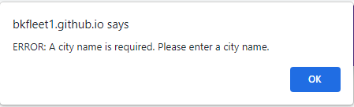

# Local Weather Dashboard - Current and 5-Day Forecast

# Application Scope
The Local Weather Dashboard provides user with the current weather and a 5-day forecast for a city of their choice. Simply enter the city name and click the search button. Weather data is provided by Openweathermap.org' RESTful APIs which are queried dynamically to retrieve the most current information. The final result, you are presented with current weather conditions and an accurate 5-day forecast in an attractive UI. All you need to do is enter a city name and click the search button! 

# User Story
As A traveler I want to see the weather outlook for multiple cities, so that I can plan a trip accordingly.

# Acceptance Criteria
Given a weather dashboard with form inputs:
> 1. When I search for a city, then I am presented with current and future conditions for that city and that city is added to the search history
> 2. When I view current weather conditions for that city, then I am presented with the city name, the date, an icon representation of weather conditions, the temperature, the humidity, the wind speed, and the UV index
> 3. When I view the UV index, then I am presented with a color that indicates whether the conditions are favorable, moderate, or severe
> 4. When I view future weather conditions for that city, then I am presented with a 5-day forecast that displays the date, an icon representation of weather conditions, the temperature, the wind speed, and the humidity
> 5. When I click on a city in the search history, then I am again presented with current and future conditions for that city

# Repository 
The developer performed the following steps to initiate the project.

1. Logged into developers GitHub portal
2. Created a new repository named "weather" and a readme.md file
3. Enabled the repository’s web page features, which are found under the repository’s settings > pages
4. Opened Git Bash terminal entered the following commands:
>> - cd to desktop/projects
>> - git clone git@github.com:bkelley1/weather.git (clone developer's repository)
>> - cd weather
>> - touch index.html (make index.html)
>> - touch .gitignore (make .gitignore)
>> - mkdir assets (make directory assets)
>> - cd assets (change directory to assets)
>> - mkdir images (make directory images)
>> - mkdir js (make directory js)
>> - cd js (change directory to js)
>> - touch script.js (make script.js)
>> - cd .. (change directory to assects)
>> - mkdir css (make directory css)
>> - cd css (change directory to css)
>> - touch style.css (make style.css)
>> - cd ../../ (change directory to local repository root)
>> - git add - A
>> - git commit -m"initial commit"
>> - git push origin main
>> - git checkout -b develop

These steps completed the creation of the initial project files and directories. The image below illustrates the local repository created.
>> [local repository image](./assets/images/local-repository.png)

# Application & Code Repository
A working version of the application and repository are available at the following locations.
>>> Deployed Application: https://bkfleet1.github.io/weather/
>>> 

>>> Application Repository: https://github.com/bkfleet1/weather
>>> 

## Installation Instructions

1. Log into GitHub repository - https://github.com/bkfleet1/weather

2. Click on CODE button and copy ssh link - git@github.com:bkelley1/weather.git
>> The following image illustrates the process of copying the SSH link.
>> [illustration of how to copy SSH link to clone](./assets/images/clone.gif)

3. Open terminal application (e.g., Git Bash) and enter the following commands:
>> - cd [directory name where you want to store project files] (e.g., cd desktop/projects)
>> - git clone [paste copied link] (clone repository)

# Application Files
The following narrative describes the content and functions of each application file (i.e., index.html, style.css, script.js). 

## HTML Structure - index.html
The application has a single HTML file (i.e., index.html) with the following element structure. Elements with a (*) are dynamically created by functions within the application's javascript file (i.e., script.js).

> - head
> - body
> - div class = container
>> - div class = banner *
>> - div class = row * 
>>> - div class = searchDiv * (contains search form and peristent city names)
>>>> - form class = cityForm * (form for user to enter city name)
>>> - div class = weatherDiv * (contains all weather - current and forecast data)
>>>> - div class = currentWeather * (contains the current weather)
>>>> - div class = forecastBanner * (5-day forecast banner)
>>>> - div class = forecastWrapper * (contains the daily weather forecasts (qty 5))
>>>>> - div class = dailyDiv * (contains the daily weather forecast)
> - script

### Styling Resources Defined
The index.html file has two styling resources defined in the HEAD element.
> 1. Bootstrap 5.1.3 cdn, which is utilized to provide screen responsiveness.
> 2. style.css (i.e., located in ./assets/css/), which provides the visual styling for fonts, blocks, images, and other UI elements.

### Script Resources Defined
The index.html file has two scripting resources defined at the bottom of the BODY element.
> 1. Jquery 3.6.0 cdn, which provides a library of functions used within the script.js file.
> 2. script.js (i.e., located in ./assets/js/), which contains the functions used to create elements within the HTML file and populate them with images and data.

## CSS Structure - style.css
The application utilizes a single CSS file (i.e., style.css), which provides visual styling for fonts, blocks, images, and other UI elements found within the index.html file. The stylings defined are not exotic and self explanitory in the function. Additional styling is performed by Bootstrap 5.1.3, primarily to provide application responsiveness (e.g., flex) and element sizing (i.e., element width). The Bootstrap stylings used are defined in various functions within the application's script.js file.

## Javascript Structure - script.js
The script.js file contains various variables and functions, which are detailed in the following narrative.

### Variables
There are three important variabled defined within the script.js file.
> 1. urlOne - Contains the url to Openweathermap.org's current weather API endpoint (i.e., https://api.openweathermap.org/data/2.5/weather?). Further details about this resource's purpose are described within the cityFormHandler function.

> 2. urlTwo - Contains the url to Openweathermap.org's multiday weather  forecast API endpoint, known as onecall (i.e., https://api.openweathermap.org/data/2.5/onecall?). Further details about this resource's purpose are described within the cityFormHandler function.

> 3. weatherKey - contains the developer's API key with Openweathermap.org and used to authenticate API calls made by the application.

### Functions

> 1. Document Ready Function - A jquery (document).ready function that creates the application banner and cityName form when the application loads. Additional, div elements are created as part of this function, which are needed by the current and forecast components of the application. 

> 2. Submit Event Listener - Located at the bottom of the script.js file is an event listener built in jquery, which intakes the city name submitted by the application's user. The function validates the user's input, null values are rejected and valid text is then passed to the cityFormHandler function. Invalid inputs receive an alert illustrated in the image below.
>> 

> 3. cityFormHandler Function - Performs two API calls to Openweathermap.org, parses the data from each API's response, and passes the parsed date into the currentWeather and forecastWeather functions. 
>>> - a. Using the "cityName" passed by the Submit Event Listener as a parameter, the function utilizes the urlOne and weatherKey to perform an API call to Openweathermap.org to retrieve the current weather for the City input by the end-user. An additional parameter is included in the API call, units=imperial, which indicates that the data returned is to be in the imperial units of measure.
>>> - b. The function checks the API reponse for error and provides an alert if an error occurs. Data from an "ok" response is parsed, providing the city's name, latitude, longitude, and current weather.
>>> - c. The function then performs a second API call, using the urlTwo and weatherKey variables, and latitude and longitude parsed from the first API call to retrieve the 5-day weather forecast. Agan, the units=imperial parameter is used to indicate the data to-be returned is in the imperial units of measure format. 
>>> - d. The function checks the API reponse for error and provides an alert if an error occurs. The data from an "ok" response is parsed for the current day's UV index (i.e, tUvi), a data element not found in the first API call. The unparsed daily forecast, an array of weather daily weather information is then passed into the forecastWeather function described below.
>>> - e. Finally, the function passes the passes the parsed data from the first API call (current weather) and today's date to the currentWeather function.

> 4. currentWeather Function - Envokes several sub-functions that create elements and assemble the parsed current weather information. The following are noteworthy key sub-functions within the currentweather Function.
>> 4.1 crtUviBtn Function - Creates a button in which the current weather's UV Index value is displayed. The uviColor Function described below is called within the crtUviBtn Function.
>> 4.2 uviColor Function - Adds the class name to the button created by the crtUviBtn function. The class assigned is determined by the current UV index value (tUvi) based on the EPA's published UV scale shown below. The class assigned to the button is associated with a CSS styling in the style.css file, which defines the button's background color.
>> 
>> 4.3 crtIcon Function - Creates the weather icon displayed in current weather based on the icon code provided as a data item in the first API call. The function appends the icon code to a URL to link the image residing on an Openweathermap.org server.

> 5. forecastWeather Function - Using a for loop, the function parses the data array from the second API call (i.e., weather forecast). The parsed daily weather forecast data is passed to several several sub-functions within the loop to create and assemble the elements and weather forecast information (contained within the div class = DailyDiv). The following are noteworthy key sub-function(s) within the currentweather Function.
>> 5.1 getForecastIcon Function - Creates the weather icon displayed in the daily weather forecasts based on the icon code provided as a data item in the second API call. The function appends the icon code to a URL to link the image residing on an Openweathermap.org server.

# Acceptance Criteria Notes
The application acceptance criteria 1 - 4 were completed as described:
> 1. When I search for a city, then I am presented with current and future conditions for that city and that city is added to the search history
> 2. When I view current weather conditions for that city, then I am presented with the city name, the date, an icon representation of weather conditions, the temperature, the humidity, the wind speed, and the UV index
> 3. When I view the UV index, then I am presented with a color that indicates whether the conditions are favorable, moderate, or severe
> 4. When I view future weather conditions for that city, then I am presented with a 5-day forecast that displays the date, an icon representation of weather conditions, the temperature, the wind speed, and the humidity

The following animated image illustrates the functionality provided by the application to satisfy criteria 1-4.
>> 

Criteria 5 defined below was only partially completed. The application does not have a search history function as described due to time constraints, but does console.log the city name entered by the user. The following image show the captured city name.
> 5. When I click on a city in the search history, then I am again presented with current and future conditions for that city
>> 